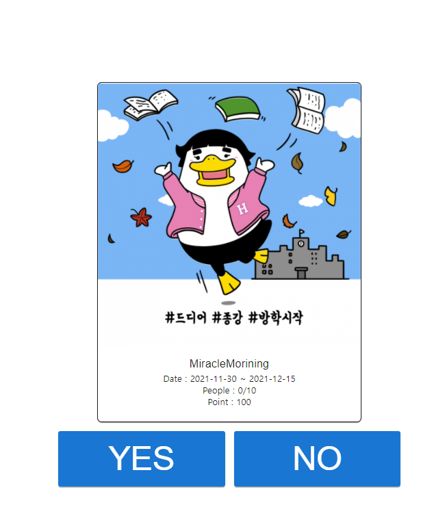
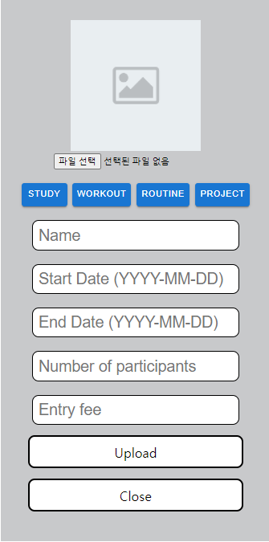

# Team B Capstone Project S-gether


## 프로젝트 배경
인스타그램에서 공스타그램 관련 해시태그를 가진 게시물은 640만개로 공스타 그램에 대한 수요는 여전히 뜨겁다. 공스타그램을 하는 사람들은 해당 게시글이 자신들의 목표나 계획을 이행하는데 동기부여가 된다고 한다. 
또한 팬데믹으로 인한 비대면 스터디가 대학가를 휩쓸고 있다. 이에 우리 팀은 사용자들이 자신들의 공스타그램, 스터디 모집, Todo list작성을 모두 할 수 있는 플랫폼을 만들고자 했다.

---

## 프로그램 초기 설정
```
git clone https://github.com/7ZXU/SWE3028-TeamB.git
cd .\SWE3028-TeamB\
npm install
cd client
npm install
```
---
## 프로젝트 실행
```
cd .\SWE3028-TeamB\
yarn dev
```
---

## S-gether 프로젝트 설명
---
###[로그인 기능]

1. 회원 가입 기능

    처음 로그인 페이지에서 아이디가 없으신가요? 라는 부분을 클릭하면 사용자 회원가입 페이지로 넘어간다.
2. 로그인 기능

    사용자가 올바른 아이디와 비밀번호를 입력하면 jwt방식 토큰이 사용자에게 발급되고 이를 이용하여 사용자의 정보가 인증된다.
---
### [사용자 정보 페이지]

1. 사용자 정보 수정

    사용자 정보를 수정할 수 있는 페이지이다.

2. 사용자 포인트 충전

    사용자가 챌린지를 참여하고 보상이나 패널티를 받을 때 포인트를 받는다. 이를 충전 할 수 있는 페이지이다.

3. 보상, 패널티 목록

    사용자가 받은 보상과 패널티 관련 정보를 보여주는 페이지 부분이다.

4. Setting

    
---
### [Challenge Page]


1. 사용자 참여 챌린지 정보

    사용자가 참여하고 있는 챌린지 목록을 왼쪽과 같이 보여준다.

2. Hot Challenges

    현재 진행 중인 챌린지에 대한 챌린지 카드를 보여준다.

3. Looking for a challenge Members

    현재 사람들을 모집하는 챌린지 목록을 보여준다.
    해당 오른쪽에는 해당 챌린지 카드를 보여준다.
    챌린지 카드를 클릭하면 해당 챌린지에 참여할지에 관한 팝업이 뜬다.


    

4. Add Challenge

    사용자가 하고자 하는 챌린지를 등록할 수 있다.

    
    

---
### [My Challenge Page]


1. Challenge info

   현재 challenge의 사진과 정보를 보여준다.
2. Challenge list

   
   각 날짜의 성공이나 실패여부를 보여준다. 누르면 각 날짜의 Day todo 와 Certification을 보여준다.
3. User & mate name

   
   참가자를 보여준다. 누르면 진행상황을 Pie차트로 보여준다.
   
4. Day todo
   

   선택한 날짜의 todolist를 보여준다.
   
   선택한 날짜의 todo를 추가할 수 있다.
5. Certification

   
   선택한 날짜의 인증사진을 보여준다.
   
   사진을 누르면 challenge를 잘 수행했는지 선택할 수 있다.

   
   
   선택한 날짜의 인증사진을 업로드할 수 있다.


